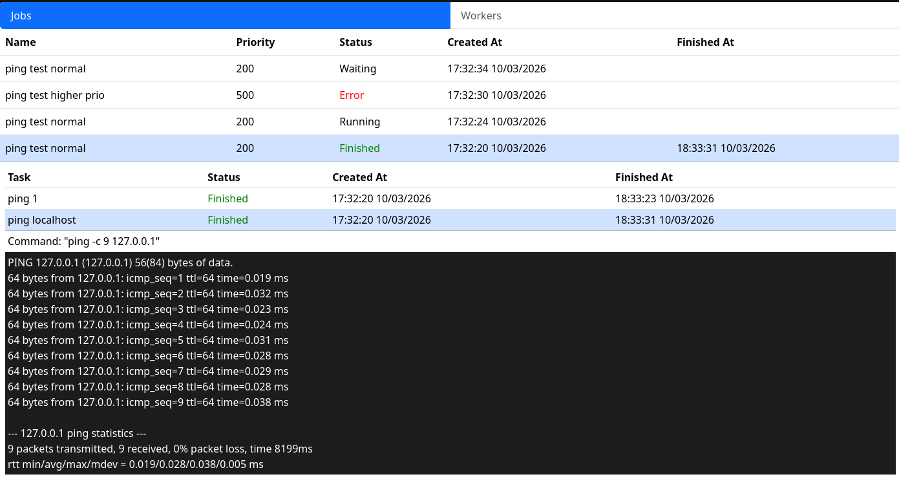

## Overview

This is a project for learning Go and Backend, using React and TS as a frontend. It is a simple distributed task manager, that supports sending a "Job" with "Tasks" to the scheduler, which then distributes all the available tasks to the worker nodes over the network, based on the creation date and the priority. It also supports showing the status and output of the command in the GUI. The app uses websockets for real-time communication between server, workers, and clients.

## Technologies

- Go
- Postgres
- React
- Docker
- Bootstrap

## Dependencies

- Go
- React
- Docker

Please follow the official docs to install these.

## Getting started

> [!CAUTION]
> Do not run this facing the public internet since it has no concept of security and will allow for execution of ANY command on your workers!

1. Clone the repository
2. Rename the `.env.example` to `.env` and enter your own values if preferred
3. Run the `npm install` to get the frontend dependencies
4. Run `docker compose up -d` to run and init the Postgres database

> [!NOTE]
> The server ports are hardcoded in the frontend, so if you change them in the `.env` make sure to also adjust it in the `./src/App.tsx`

## Usage

1. Run the scheduler with go run `./cmd/scheduler`
2. Run the frontend with `npm run dev`
3. Run the worker with go run `./cmd/worker`
4. (OPTIONAL) Repeat for multiple workers
5. Use the sh scripts in `./examples` to send some ping jobs to the server

## Things to improve on

- This is a security nightmare, so adding auth and permissions would be great
- Supporting nested tasks instead of a flat hierarchy
- Tidying up more error handling for connection losses
